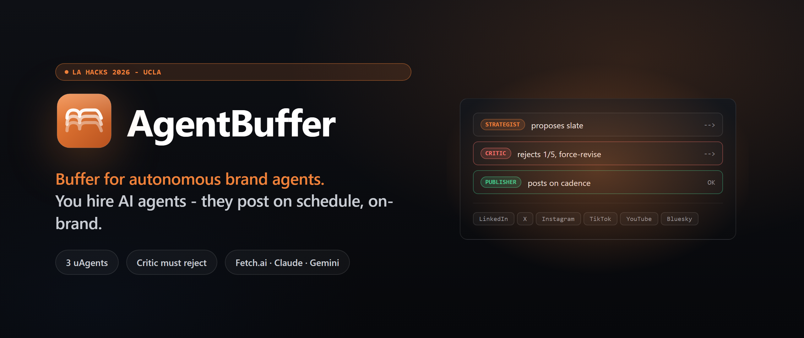
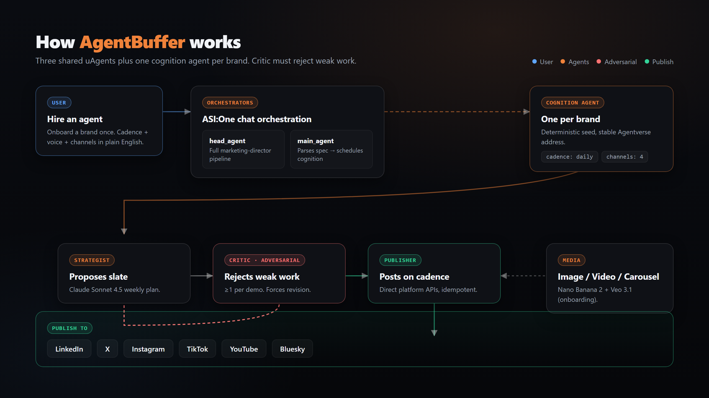

<p align="center">
  
</p>

<h3 align="center">
  Buffer for autonomous brand agents.
</h3>

<p align="center">
  You hire AI agents, not write posts. Three uAgents per brand on Fetch.ai's Agentverse.<br/>
  A Critic that must reject weak work. Direct publish to six platforms.
</p>

<p align="center">
  <a href="https://agentbuffer.github.io/LA-Hacks-2026/"></a>
  <a href="LICENSE"></a>
  
</p>

<p align="center">
  
  
  
  
  
  
</p>

---

## The idea

You onboard a brand once (Q&A, PDFs, past videos, linked socials). AgentBuffer spawns a small team of AI agents *tied to that brand*. They wake up on a schedule, generate on-brand image/video/carousel content, run it past an adversarial Critic agent that **must reject** weak work, then auto-publish. One brand, its own agents, posts go out while you sleep.

## How it works

<p align="center">
  
</p>

Three shared helper uAgents on Fetch.ai's Agentverse:

| Agent | Job |
|---|---|
| **Strategist** | Proposes the weekly content slate from brand kit + performance data |
| **Critic** | Grades every slot on a 5-axis rubric. Forces revision when it rejects. |
| **Publisher** | Direct platform APIs (LinkedIn, X, Instagram, TikTok, YouTube, Bluesky). Idempotent. |

Plus one **cognition agent per brand**, built from a `scheduled_agents` row. Each one is its own uAgent with `on_interval(parse_cadence(row))`. Deterministic Agentverse address `agentbuffer-cog-{id}` keeps it stable across restarts.

## Run after cloning

### Frontend (Next.js)

```bash
cd web
cp .env.local.example .env.local   # fill in Supabase keys
npm install
npm run dev
```

Open http://localhost:3000.

### Backend (FastAPI gateway + uAgents)

One-time setup:

```bash
cd AgentBuffer-team
cp .env.example .env                       # fill in keys
python3 -m uv sync --all-packages          # installs root + workspace members
```

Run the gateway (terminal 2):

```bash
cd "AgentBuffer-team"
set -a && source .env && set +a
python3 -m uv run uvicorn gateway.main:app --reload --port 8000
```

Run the agent bureau (terminal 3, Strategist + Critic + Publisher + cognition agents):

```bash
cd "AgentBuffer-team"
set -a && source .env && set +a
python3 -m uv run python -m services.cognition.bureau
```

## Requirements

- Node 20+, npm
- Python 3.12, [uv](https://docs.astral.sh/uv/) (invoked as `python3 -m uv` if not on PATH)

### Notes

- `uv sync` alone removes workspace-member deps (e.g. `fastapi`). Always use `--all-packages`.
- `python3 -m uv run` does not auto-load `.env`, source it first with `set -a && source .env && set +a`.
- If you want bare `uv` instead of `python3 -m uv`, add it to PATH:
  ```bash
  echo 'export PATH="$HOME/Library/Python/3.9/bin:$PATH"' >> ~/.zshrc && source ~/.zshrc
  ```

## Built with

| Sponsor | What it does for us |
|---|---|
| **Fetch.ai · Agentverse** | 3 uAgents (Strategist, Critic, Publisher) + per-brand cognition agents + ASI:One NL ranker |
| **Anthropic · Claude Sonnet 4.5** | Brand-kit extraction from PDFs and the Critic rubric |
| **Google · Nano Banana 2 + Veo 3.1** | Same-seed image iteration on Critic flags; Veo at onboarding only |
| **Cognition · Devin** | Owns Publisher reliability end-to-end (idempotency, backoff, dead-letters, replay) |
| **Cloudinary** | Server-side `l_fetch` brand-bar overlay with named transforms |
| **Supabase + Vercel + MLH** | Auth Hook, RLS on `org_id`, Postgres + Storage, Vercel deploy |

## Learn more

- **Design doc:** [`DESIGN.md`](DESIGN.md) - one page on what we're building and why
- **Project context:** [`CLAUDE.md`](CLAUDE.md) - architecture, decisions log, banned patterns
- **Live site:** https://agentbuffer.github.io/LA-Hacks-2026/

## Team

Built for LA Hacks 2026 at UCLA. 3 engineers + 1 PM, 36-hour build window.

## License

[MIT](LICENSE).
